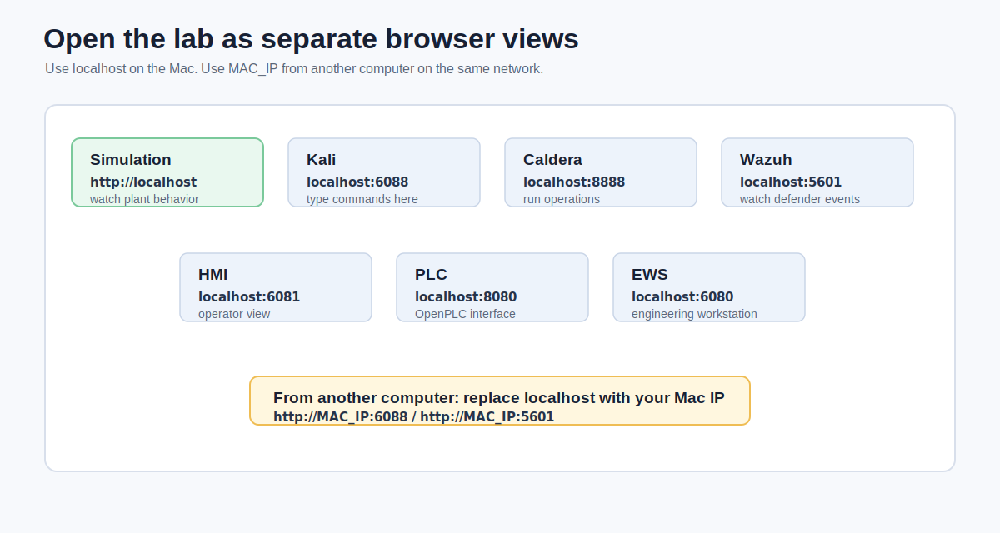
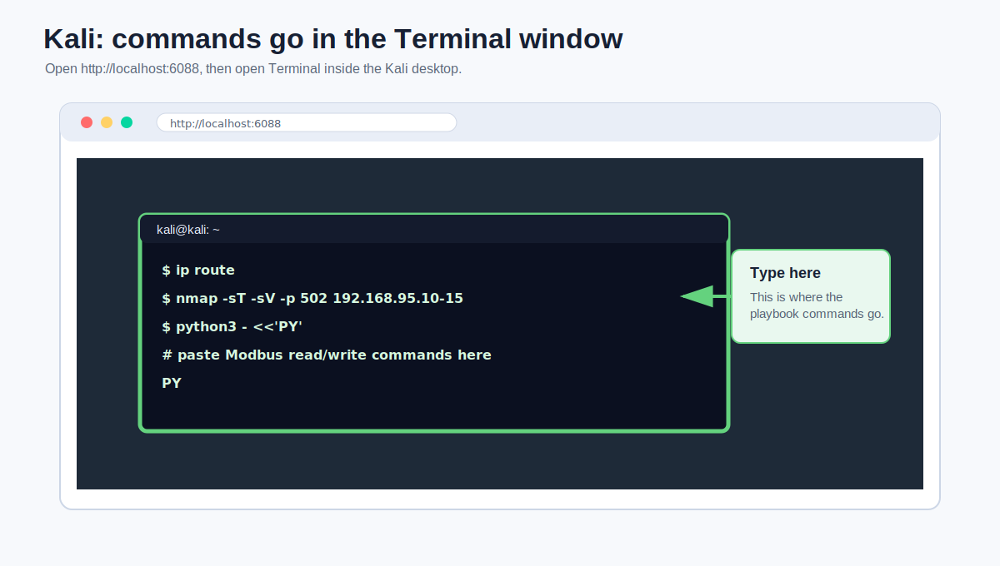
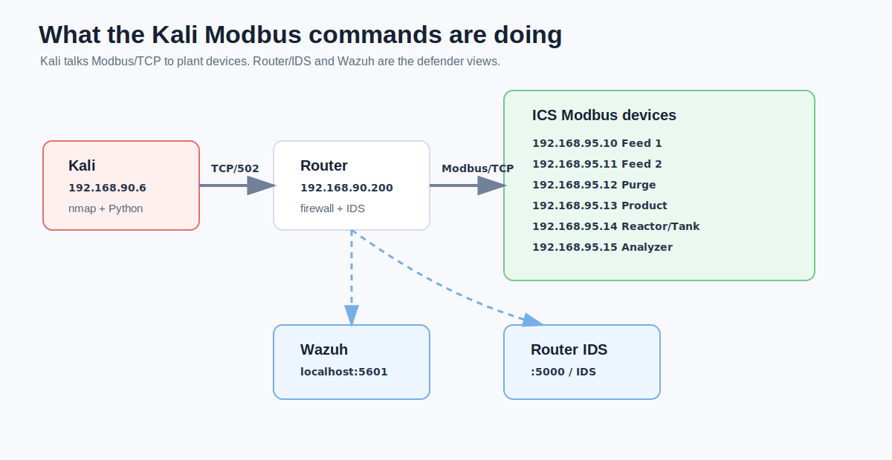
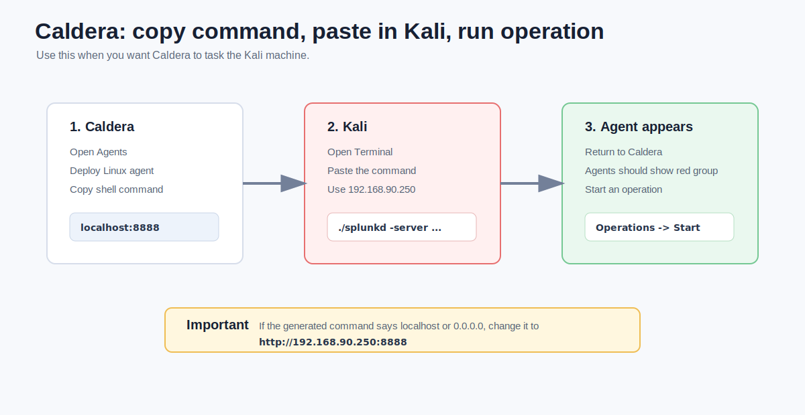

# GRFICSv3 Lab Worksheet

This worksheet is for students using a GRFICSv3 lab that is already running.

Use it with:

- [Running lab playbook](GRFICSv3_RUNNING_LAB_PLAYBOOK.md)
- [Visual step-by-step guide](GRFICSv3_VISUAL_STEP_BY_STEP_GUIDE.md)

Only run commands inside your GRFICS lab.

## Student Info

| Field | Response |
| --- | --- |
| Name |  |
| Date |  |
| Team / Group |  |
| Lab Mac IP, if remote |  |

## Learning Goals

By the end of this lab, you should be able to:

- Identify the main GRFICSv3 systems and browser views.
- Use Kali to discover OT/ICS hosts in the lab network.
- Read and change Modbus values in the simulated plant.
- Observe how process changes appear in the simulation, HMI, PLC, IDS, and Wazuh.
- Explain how attacker, defender, and operator views relate to each other.

## Part 1: Open the Lab Views

Open the lab views in separate browser tabs or on separate computers.



Fill in the exact URLs you used.

| View | URL Used | Login Used | Opened? |
| --- | --- | --- | --- |
| Simulation / game |  | none | [ ] |
| Kali attacker |  |  | [ ] |
| Caldera |  |  | [ ] |
| Wazuh defender |  |  | [ ] |
| Engineering workstation |  | none | [ ] |
| HMI |  |  | [ ] |
| PLC |  |  | [ ] |

Question: If you opened a view from another computer, what did you replace `localhost` with?

Answer:

```text

```

## Part 2: First Look at the Simulation

Keep the simulation open while you work.


Answer these before running any commands.

| Observation | Your Notes |
| --- | --- |
| What do you see in the main simulation view? |  |
| What parts look like tanks, valves, pipes, or control equipment? |  |
| What changes do you expect to see if a valve is opened or closed? |  |

Short answer: Why is it useful to watch the physical simulation while running cyber commands from Kali?

```text

```

## Part 3: Know the Network

Use the playbook's lab IP table to complete this map.

| System | IP / Port | Role in the Lab |
| --- | --- | --- |
| Kali |  |  |
| Router / firewall |  |  |
| Caldera |  |  |
| Wazuh |  |  |
| HMI / ScadaLTS |  |  |
| PLC / OpenPLC |  |  |
| Feed 1 Modbus device |  |  |
| Reactor/Tank Modbus device |  |  |

Question: Which network looks like the attacker/DMZ side?

```text

```

Question: Which network looks like the plant/ICS side?

```text

```

## Part 4: Kali Command Check

Open Kali and start a terminal.




Run:

```bash
ip addr
ip route
```

Record what you found.

| Check | Result |
| --- | --- |
| Kali IP address |  |
| Kali network interface name |  |
| Route toward the ICS network |  |

Run the ping checks from the playbook.

| Target | Command Run | Success? | Notes |
| --- | --- | --- | --- |
| Router |  | [ ] yes / [ ] no |  |
| PLC |  | [ ] yes / [ ] no |  |
| Feed 1 Modbus device |  | [ ] yes / [ ] no |  |

Question: What does a successful ping prove? What does it not prove?

```text

```

## Part 5: Discovery from Kali

Run the discovery scans from the playbook.

| Scan | Command Used | Interesting Hosts Found |
| --- | --- | --- |
| DMZ discovery |  |  |
| ICS discovery |  |  |
| Web service scan |  |  |
| Modbus scan |  |  |

Question: Which hosts had port `502` open?

```text

```

Question: Why is port `502` important in this lab?

```text

```

## Part 6: PLC and HMI Views

Open the PLC from inside Kali's browser.


| PLC Check | Your Notes |
| --- | --- |
| URL used |  |
| Login used |  |
| One useful page or setting you noticed |  |

Open the HMI from inside Kali's browser.


| HMI Check | Your Notes |
| --- | --- |
| URL used |  |
| Login used |  |
| What process values or graphics did you see? |  |

Question: How are the PLC, HMI, and simulation related?

```text

```

## Part 7: Read Modbus Values

Use the playbook command to read Feed 1, then read all Modbus devices.



Record the values you observed.

| Device | IP | Register Values | What You Think They Mean |
| --- | --- | --- | --- |
| Feed 1 |  |  |  |
| Feed 2 |  |  |  |
| Purge |  |  |  |
| Product |  |  |  |
| Reactor/Tank |  |  |  |
| Analyzer |  |  |  |

Question: The values are scaled from `0` to `65535`. What would `0`, about `32768`, and `65535` mean for a valve?

| Value | Meaning |
| --- | --- |
| `0` |  |
| `32768` |  |
| `65535` |  |

## Part 8: Change a Valve and Observe

Use the playbook to change Feed 1. Watch the simulation and HMI while you do it.

| Action | Command Value | Simulation Observation | HMI Observation |
| --- | --- | --- | --- |
| Close Feed 1 | `0` |  |  |
| Set Feed 1 about halfway | `32768` |  |  |
| Open Feed 1 fully | `65535` |  |  |

Short answer: What changed when you closed Feed 1?

```text

```

Short answer: Did the cyber command cause a visible physical/process effect? Explain.

```text

```

## Part 9: Defender View in Wazuh

Open Wazuh and go to security events.


Fill in what you see.

| Check | Result |
| --- | --- |
| Wazuh URL used |  |
| Login used |  |
| Active agents seen |  |
| One event source you found |  |
| One event message or rule you found |  |

Question: Which systems should appear as Wazuh agents?

```text

```

Question: Did Wazuh show evidence of your activity? If yes, what activity?

```text

```

## Part 10: Router IDS and Firewall

Open the router/firewall UI.


Record the IDS check.

| Check | Your Notes |
| --- | --- |
| Router UI URL used |  |
| Login used |  |
| IDS page found? | [ ] yes / [ ] no |
| Alert seen after scan? | [ ] yes / [ ] no |
| Alert message or source/destination |  |

Add the simple IDS rule from the playbook, then run the Modbus scan again.

| Rule / Test | Result |
| --- | --- |
| Rule added? | [ ] yes / [ ] no |
| Scan command run |  |
| Alert appeared? | [ ] yes / [ ] no |

Optional firewall test: Add the block rule from the playbook.

| Firewall Test | Result |
| --- | --- |
| Source blocked |  |
| Destination blocked |  |
| Port blocked |  |
| What changed in the Kali scan result? |  |

Question: What is the difference between an IDS alert and a firewall block?

```text

```

## Part 11: Caldera Agent and Operation

Open Caldera.


Start a Caldera agent on Kali.



Record the deployment.

| Check | Result |
| --- | --- |
| Caldera URL used |  |
| Login used |  |
| Agent group |  |
| Server value used in the agent command |  |
| Did the Kali agent appear in Caldera? | [ ] yes / [ ] no |

Run manual commands through Caldera and record results.

| Command | Result / Observation |
| --- | --- |
| `whoami` |  |
| `ip route` |  |
| `nmap -sT -p 502 192.168.95.10` |  |

Question: How is running a command through Caldera different from typing it directly in Kali?

```text

```

Question: Did Wazuh or the IDS show evidence of Caldera-driven activity?

```text

```

## Part 12: Built-In Modbus Caldera Ability

Run the built-in Modbus ability from the playbook.

| Item | Value Used |
| --- | --- |
| Ability name |  |
| Adversary name |  |
| Fact source |  |
| Target IP |  |
| Target port |  |

Expected behavior checklist:

- [ ] Caldera tasked the Kali agent.
- [ ] The agent ran the Modbus payload.
- [ ] The target was `192.168.95.10:502`.
- [ ] Wazuh or IDS showed related activity.

Question: What makes an automated Caldera operation useful for training defenders?

```text

```

## Part 13: Attack / Defend Timeline

Write a short timeline of what happened in your lab.

| Time | Action | System Used | Evidence / Result |
| --- | --- | --- | --- |
|  |  |  |  |
|  |  |  |  |
|  |  |  |  |
|  |  |  |  |
|  |  |  |  |

## Part 14: Reflection Questions

Answer in complete sentences.

1. What was the most important connection between the cyber side and the physical simulation?

```text

```

2. Which defender view was most useful: Wazuh, router IDS, firewall logs, HMI, or simulation? Why?

```text

```

3. What is one risk of exposing these lab services directly to the public internet?

```text

```

4. Why is a private overlay network such as Tailscale safer than public port forwarding for this lab?

```text

```

5. What is one detection or firewall rule you would add next?

```text

```

## Completion Checklist

- [ ] I opened the simulation, Kali, Caldera, Wazuh, HMI, and PLC views.
- [ ] I found Kali's IP address and route information.
- [ ] I scanned the DMZ and ICS networks from Kali.
- [ ] I identified Modbus devices on port `502`.
- [ ] I read Modbus values from the plant.
- [ ] I changed Feed 1 and observed the result.
- [ ] I checked Wazuh events.
- [ ] I checked router IDS alerts.
- [ ] I started a Caldera agent on Kali.
- [ ] I ran at least one Caldera operation.
- [ ] I recorded a short attack/defend timeline.

