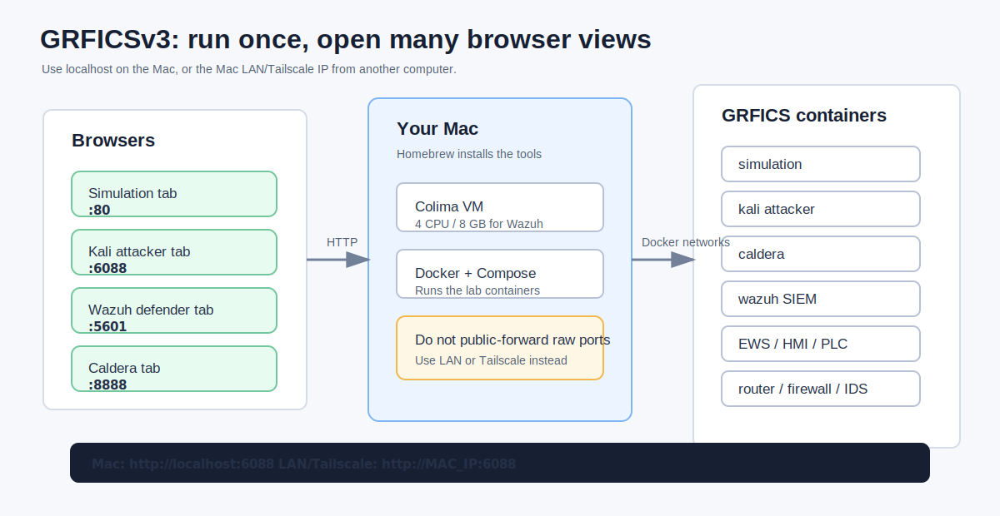

# GRFICSv3 Visual Step-by-Step Guide

This guide shows how to install, run, access, and shut down GRFICSv3 on a Mac. The goal is to use your Mac like a small lab server, then open the simulation, Kali, Caldera, Wazuh, HMI, PLC, and workstation in separate browser tabs or on separate computers.


## What You Are Building

GRFICSv3 is a containerized OT/ICS cyber range. It simulates a chemical plant, PLCs, HMI, engineering workstation, attacker tools, Caldera automation, firewall/IDS, and optional Wazuh SIEM.


Simple picture:



## 1. Install Homebrew

Open Terminal.

Check whether Homebrew is already installed:

```bash
brew --version
```

If it prints a version, continue.

If it is missing, install Homebrew from:

```text
https://brew.sh
```

## 2. Install Docker Tools

Install Docker CLI, Docker Compose, and Colima:

```bash
brew install docker docker-compose colima
```

Colima gives your Mac a lightweight Linux VM that runs Docker.

Check the tools:

```bash
docker --version
docker compose version
colima version
```

## 3. Fix Docker Compose Plugin Path

If this command works, skip to the next step:

```bash
docker compose version
```

If it says `unknown command: docker compose`, create Docker's config folder:

```bash
mkdir -p ~/.docker
```

Create or edit this file:

```text
~/.docker/config.json
```

Put this inside:

```json
{
  "cliPluginsExtraDirs": [
    "/opt/homebrew/lib/docker/cli-plugins"
  ]
}
```

Try again:

```bash
docker compose version
```

## 4. Clone GRFICSv3

Pick a folder where you want the lab to live, then run:

```bash
git clone https://github.com/Fortiphyd/GRFICSv3.git
cd GRFICSv3
```

You should see files such as:

```text
docker-compose.yml
simulation
attacker
caldera
plc
router
scadalts
wazuh
workstation
```

## 5. Start Docker

For the basic lab:

```bash
colima start
```

For the full attacker + defender + Caldera + Wazuh setup, use more memory:

```bash
colima start --cpu 4 --memory 8
```

Check Docker:

```bash
docker info
```

If Docker prints server information, it is ready.

## 6. Start the Basic Lab

From inside the `GRFICSv3` folder:

```bash
docker compose up -d
```

Check status:

```bash
docker compose ps
```

You want the main containers to say `Up`. The `router` and `simulation` services should become `healthy`.


## 7. Start the Full Defender Lab with Wazuh

Wazuh is optional, but use it if you want the defender/SIEM view.

Start everything, including Wazuh:

```bash
docker compose --profile siem up -d
```

On first run, Wazuh may build locally and download large packages. This can take several minutes.

Check status:

```bash
docker compose --profile siem ps
```

Check connected Wazuh agents:

```bash
docker exec wazuh /var/ossec/bin/agent_control -l
```

A healthy connected setup should include agents like:

```text
ID: 001, Name: EWS, Active
ID: 002, Name: router, Active
ID: 003, Name: scadalts, Active
```

If Wazuh gets killed or never loads, stop Colima and restart it with more memory:

```bash
docker compose --profile siem down
colima stop
colima start --cpu 4 --memory 8
docker compose --profile siem up -d
```

## 8. Open the Main Browser Views

On the Mac running GRFICSv3, use these URLs:

| Role | URL | Login |
| --- | --- | --- |
| Simulation | `http://localhost` | none |
| Engineering Workstation | `http://localhost:6080` | none |
| Kali attacker | `http://localhost:6088` | `kali / kali` |
| Caldera | `http://localhost:8888` | `red / fortiphyd-red` |
| Wazuh defender | `http://localhost:5601` | `admin / admin` |
| PLC / OpenPLC | `http://localhost:8080` | `openplc / openplc` |
| HMI / ScadaLTS | `http://localhost:6081` | `admin / admin` |

Open each important role in its own browser tab or browser window:

```text
Tab 1: Simulation
Tab 2: Kali
Tab 3: Caldera
Tab 4: Wazuh
Tab 5: HMI / PLC
```

## 9. Open from Another Computer

`localhost` only works on the Mac that is running Docker.

Think of the Mac as the GRFICS server:

```text
Mac runs Colima + Docker + GRFICS
Other browsers connect to the Mac
Each GRFICS role uses a different port
```

To use another computer on the same Wi-Fi or LAN, find your Mac IP:

```bash
ipconfig getifaddr en0
```

Example output:

```text
10.231.171.156
```

Then replace `localhost` with that IP:

```text
http://10.231.171.156
http://10.231.171.156:6080
http://10.231.171.156:6088
http://10.231.171.156:6081
http://10.231.171.156:8080
http://10.231.171.156:8888
http://10.231.171.156:5601
```

Example multi-computer layout:

| Computer or browser | Open this |
| --- | --- |
| Large display | `http://MAC_IP` |
| Attacker laptop | `http://MAC_IP:6088` |
| Defender laptop | `http://MAC_IP:5601` |
| Caldera laptop | `http://MAC_IP:8888` |
| Operator laptop | `http://MAC_IP:6081` |
| Engineering laptop | `http://MAC_IP:6080` |

For access outside your network, use a private VPN/overlay network such as Tailscale. Avoid exposing these services directly to the public internet.

## 10. What Each Screen Is For

### Simulation

Use this to watch the plant and process behavior.


### Kali Attacker

Use this as the attacker machine. Open it in a separate browser so you can work while watching the plant or defender dashboard.


### Caldera

Use this for adversary emulation and automated operations.


### Wazuh Defender

Use this as the defender/SIEM dashboard. It receives logs and alerts from connected agents such as `router`, `EWS`, and `scadalts`.


### Engineering Workstation

Use this for engineering workstation workflows and access to OT tools.


### HMI

Use this as the operator interface.


### PLC

Use this for the OpenPLC web interface.


### Firewall / IDS

Use this to inspect or adjust firewall and IDS behavior.


### Physical Walkthrough

The simulation includes physical-security and cyber-hygiene findings. The tracker counts discovered issues.


## 11. Recommended Classroom or Demo Layout

Use multiple browsers or computers:

| Screen | Suggested Use |
| --- | --- |
| Projector or large display | Simulation |
| Laptop 1 | Kali attacker |
| Laptop 2 | Wazuh defender |
| Laptop 3 | Caldera |
| Laptop 4 | HMI / PLC |

Keep the Mac plugged in. The full lab with Wazuh uses a lot of CPU and memory.

## 12. Quick Health Checks

Check containers:

```bash
docker compose --profile siem ps
```

Check Wazuh agents:

```bash
docker exec wazuh /var/ossec/bin/agent_control -l
```

Check dashboard ports:

```bash
curl -I http://localhost
curl -I http://localhost:6088
curl -I http://localhost:8888
curl -I http://localhost:5601
```

Expected signs:

```text
Simulation: 200 OK
Kali: 200 OK
Caldera: 405 Method Not Allowed or login page on GET
Wazuh: 302 redirect to /app/login
```

## 13. Stop the Lab

For the basic lab:

```bash
docker compose down
colima stop
```

For the full Wazuh/SIEM lab:

```bash
docker compose --profile siem down
colima stop
```

This removes the running containers and networks. It does not delete Docker images or named volumes.

## 14. Start Again Later

Basic lab:

```bash
cd GRFICSv3
colima start
docker compose up -d
```

Full attacker + defender lab:

```bash
cd GRFICSv3
colima start --cpu 4 --memory 8
docker compose --profile siem up -d
```

Open the browser URLs again.

## 15. Troubleshooting

### Docker is missing

Install the tools:

```bash
brew install docker docker-compose colima
```

### Docker daemon is not running

Start Colima:

```bash
colima start
```

### Wazuh crashes or says it was killed

Use more memory:

```bash
docker compose --profile siem down
colima stop
colima start --cpu 4 --memory 8
docker compose --profile siem up -d
```

### Another computer cannot open the URLs

Check the Mac IP:

```bash
ipconfig getifaddr en0
```

Make sure the other computer is on the same network. Use:

```text
http://MAC_IP:PORT
```

not:

```text
http://localhost:PORT
```

### You want remote access from outside the building

Use Tailscale or another private VPN. Do not directly expose Kali, Caldera, PLC, HMI, or Wazuh to the public internet.
